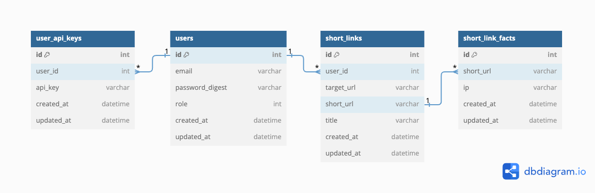
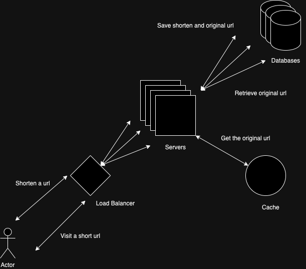

# Software Versions #

Software versions as of 11 March 2024
- Ruby: `3.2.1`
- Rails: `7.1.3`
- Redis: `7.0.4`
- PostgreSQL: `14.7`

## ⚙️ Installation ##

> Feel free to omit any steps if you have them installed :smile:

1. Install Homebrew
    ```sh
    /bin/bash -c "$(curl -fsSL https://raw.githubusercontent.com/Homebrew/install/HEAD/install.sh)"
    ```
   
2. Install Ruby using Ruby Version Management Tool (rbenv)
    ```sh
    # Install rbenv on MacOS/Linux
    brew install rbenv ruby-build
    rbenv init

    # Check rbenv installation
    # Reports status of rbenv installation
    curl -fsSL https://github.com/rbenv/rbenv-installer/raw/main/bin/rbenv-doctor | bash

    # Install Ruby 3.2.1
    rbenv install 3.2.1
    ```
   
3. Install PostgreSQL
    ```sh
    # List the available versions
    brew search postgresql@
   
    # Install the latest version
    brew install postgresql
    ```
   
4. Install Redis
    ```sh
    # List the available versions
    brew search redis@
   
    # Install the latest version
    brew install redis
    ```
   
5. Install Bundler
    ```sh
    gem install bundler:2.4.6
    ```
    > The Bundler gem provides the `bundle install` command. It is a dependency manager for Ruby, written in Ruby.
    
6. Install Foreman (optional)
    ```sh
    gem install foreman
    ```
    > Foreman is used to start **sidekiq** and **puma** server in development environment. You may omit it if you spinning up the servers using `bin/dev`.

## 💻 Starting the App ##

1. Ensure PostgreSQL and Redis are running
    ```sh
    brew services start postgresql
    brew services start redis
    ```
   
2. Install the dependencies
    ```sh
    bundle install
    npm install
    ```
   
3. Create the database
    ```sh
    rails db:create
    ```
   
4. Run the migrations
    ```sh
    # Run the migrations
    rails db:migrate
   
    # Check the status of the migrations
    rails db:migrate:status
   
    # Seed the database
    rails db:seed  
    ```
   
5. Start the server
    ```sh
    bin/dev
    ```
    > The `bin/dev` script starts the **sidekiq** and **puma** server using **foreman**.

6. Visit the application
    ```sh
    open http://localhost:3000
    ```
    > The application should be running on `http://localhost:3000`
   >

## 🧪 Running the Test Suite ##
RSpec is the testing framework for this project. It is used to test the application. The test suite can be run using the following command:
```sh
# Run the test suite
rspec spec/services/token_service/create_spec.rb
```

## 🚀 Deployment ##
**Note**: The application is deployed on Koyeb. You can visit the deployed application [here](https://crypto-alert-teamray.koyeb.app/).

# Planning the deliveries #

## Overview ##
The application is a simple web application that allows users to make long links shorter. Users are not required to sign up to use the service. 
However, if the user wants to keep track of the links they have shortened, they can sign up and log in to the application. 
An endpoint is provided to shorten the link programmatically.

## Use Cases ##
The following are the use cases of the application:
- User can sign up
- User can log in
- User can log out
- User can generate an API Key
- User can request an access token using API Key
- User can refresh their access token
- User can shorten a link programmatically using an access token
- User can shorten a link
- User can get redirected to the original link using the shortened link
- User can view the links they have shortened in the past
- User can view the statistics(**number of clicks**, **originating geolocation** and **timestamp** of each visit) of the links they have shortened
- Admin can view all the statistics of the links shortened by all users

## Non-Functional Requirements ##
The following are the non-functional requirements of the application:
- Performance: The application should be fast and responsive
- Reliability: The application should be reliable and available 24/7 with minimal downtime
- Scalability: The application should be able to handle the ever increasing number of shortened links
- Maintainability: The application should be maintainable and adaptable to changes

## REST Endpoints ##
> You can visit the API docs [here](https://crypto-alert-teamray.koyeb.app/api-docs/index.html).
1. POST /api/v1/token/access
> Return token and token validity in response. The token must be passed in the header of subsequent short url API
- No authentication required
- Content-Type: application/json
- Request parameters: api_key
- Response parameters: access_token, refresh_token, expires_in, refresh_expires_in

2. POST /api/v1/token/refresh
> Access token generated previously has expiry time. This endpoint is used to get a new access token without using api_key
- No authentication required
- Content-Type: application/json
- Request parameters: refresh_token
- Response parameters: access_token

3. POST /api/v1/url/shorten
> Shorten a target url
- Authentication required
- Content-Type: application/json
- Request parameters: target_url
- Response parameters: target_url, short_url

## Database Schema ##


- **users** table stores the user details.
- **user_api_keys** table stores the API keys of the user.
- **short_links** table stores the shortened link details.
- **short_link_facts** table stores the click details of the shortened link.


## Assumptions ##
The following are the assumptions of the application:
- Short links will not expire
- For every short link, there will be 100 clicks
- Each row of short link is around ~100 bytes (data, index, metadata and other overhead)
- Each row of short link fact (view/impression) is around ~60 bytes (data, index, metadata and other overhead)
- Short link created per day is 1 million
  - Short link created per second is ~12
  - Short link fact created per second is ~1,200
  - ~6.1GB of data is created per day
  - ~7TB of storage is required for 100 years
- Short link clicked per day is 100 million 
  - 80% of the traffic will be generated by 20% of the links, according to the Pareto principle
  - 0.2 * 0.1kb * 100 million of clicks = ~2gb of cache memory required

## High Level Architecture ##


Whenever an user shortens an url, the request will be sent to the proxy server (load balancer). The proxy server will then forward the request to one of the application server.
The traffic will be distributed evenly among the application servers. 
Round robin algorithm is recommended because the time taken to shortening an url is more or less the same. 
There are no url that is harder to shorten than the other.
Ideally, we could have a dedicated server to handle the Shorten API request if we expect a high volume of traffic.
The application server will then process the request and store the shortened link in the database. The shortened link will be returned to the user.
When a user visits on the shortened link, the application server will try to get the original link from the cache. 
If the original link is not found in the cache, the application server will get the original link from the database and store it in the cache. 
The user will then be redirected to the original link.

### Monolithic or Microservices ###
With the given use cases, it is clear that the application is simple as of now.
Monolithic architecture is chosen over microservices for the following reasons:
- Single source of truth
- Faster to ship
- Easier to develop
- Refractoring is easier

Issues:
- Build/deploy time takes longer
- Flexibility is limited when it comes to scaling

### Database ###
#### PostgreSQL Database Replication ####
PostgreSQL is used as the database to store the mapping of URLs and its corresponding statistics for this demo.
Replication is important for the following reasons:
- To scale out the read operations
- To provide high availability and fault tolerance
- To be able to keep data geographically close to the users

Leader-Followers replication.
However, we gotta ensure the consistency of the data across all the replicas.
For example, replica A has the up-to-date data but not the replica B.
If user read the usage report from replica A for the first time, and from replica B for the second time, he/she will see the inconsistencies of report data.
For this, we can use synchronous replication.
However, it comes at a cost of sacrificing the performance of the write operations.
Imagine the scenario where the leader has to wait for the followers to acknowledge the write operation and one of the followers is slow. It will slow down the write operation.
In order to mitigate this, we can use asynchronous replication for majority replicas. Synchronous replication can be used for the minority replicas.
We can always route the read operations of the same user to the same replicas to ensure the consistency.
If the leader fails, we can promote the synchronous follower to be the new leader as it has the up-to-date data.

#### Why Cassandra might be a better option if the load continues to grow? ####
- For every visit to the short link, a new row is created in the short_link_facts table.
    - This will create a lot of write operations.
    - Cassandra is designed to handle a large number of write operations.
    - The ```short_url``` can be used as the partition key and the ```created_at``` can be used as the clustering key.
    - This will allow us to query the statistics(geolocation and timestamp) of the short link by the ```short_url``` and ```created_at```.

### Short Link Generation Algorithm ###
> 6 Characters of Base64 (a-z, A-Z, 0-9, -, _)

64^6 = 68,719,476,736 keys available.
If we use 1 million keys per day, it will take 68,719 days to run out of keys, which is ~188 years. 
It is safe to assume that we will never run out of keys. It's also scalable. 
If we run out of keys or the collision happens quite often, we can simply add another character to the key.

### Why Cache the Short Link? ###
The core feature is to redirect users to the original url. We can't afford to have a slow response time. 
They will inevitably be certain short URLs which are more frequently accessed by others. 
For example, an URL that is shared on viral social media post, or the influencer with a large following. 
According to the Pareto principle, 80% of the traffic will be generated by these links. 
It makes sense to cache these links to reduce the load on the database and to improve the performance of the application.

#### Eviction Policy ####
The eviction policy determines what happens when a database reaches its memory limit.
To make room for new data, older data is evicted (removed) according to the selected policy.
**Least Recently Used (LRU)** is used for this case. 
It keeps most recently used Short Link and evicts the least recently used Short Link.
